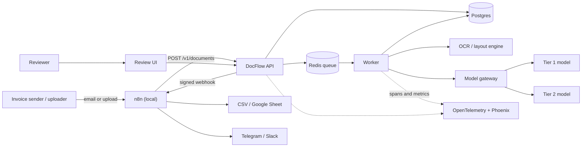
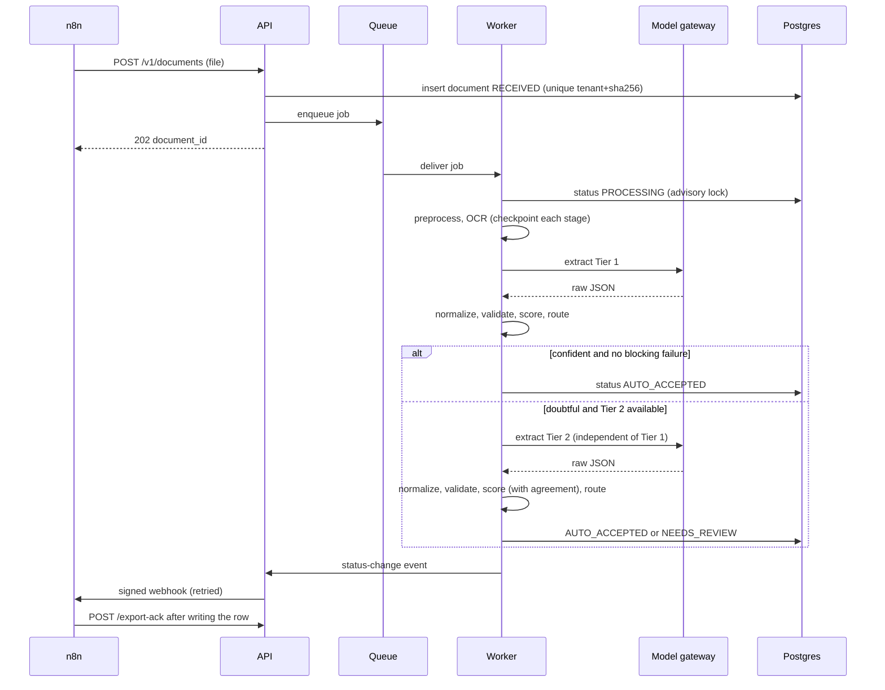
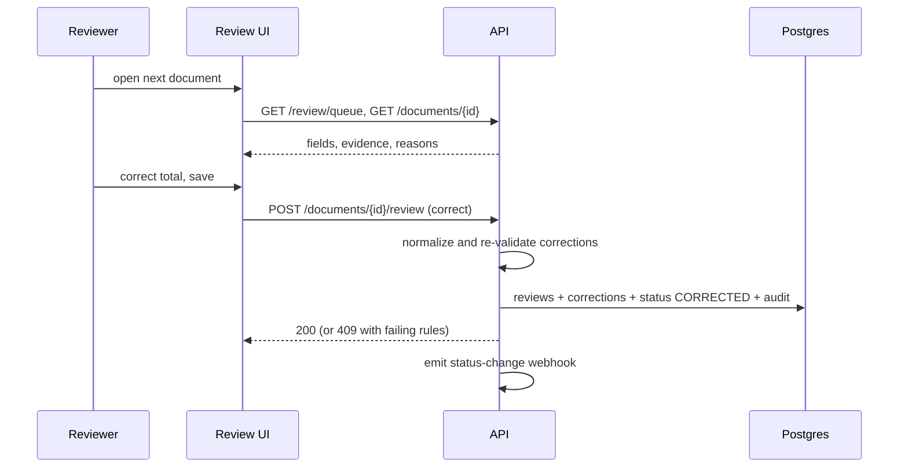
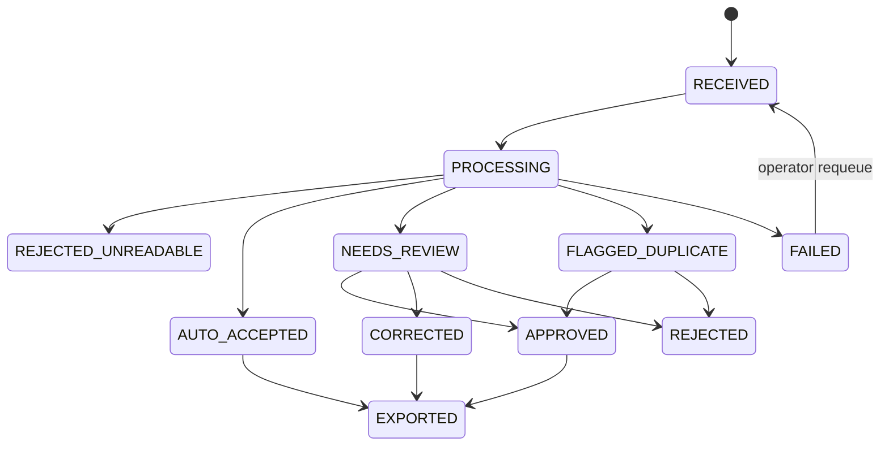
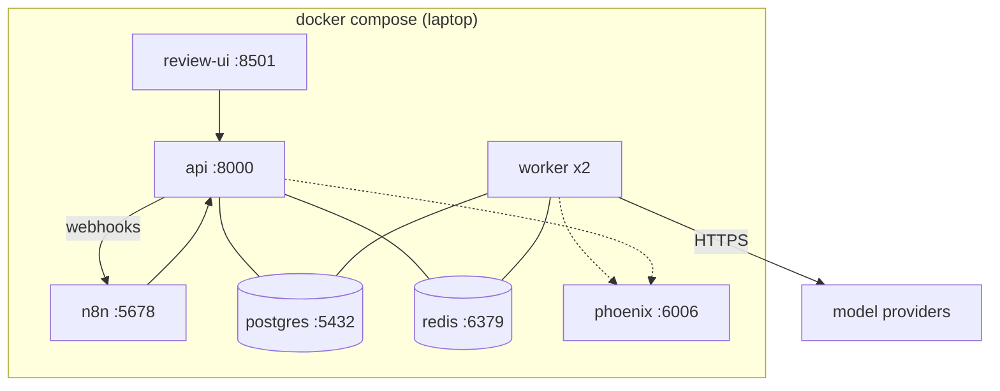

# DocFlow: Architecture Document

| | |
|---|---|
| **Version** | 1.0 (draft) |
| **Date** | 2026-09-29 |
| **Audience** | You in six months, interviewers, anyone reviewing the design |
| **Related** | `01_PRD` (what), `02_TRD` (how well), `03_Design` (what it looks like), `05_Phase_Plan` (when) |

Diagrams use Mermaid (renders on GitHub and in most Markdown viewers).

---

## 1. Purpose and architectural drivers

DocFlow's job is to turn invoices into trusted data. The architecture exists to serve six drivers, ranked. When two conflict, the higher one wins.

| Rank | Driver | Consequence for the design |
|---|---|---|
| 1 | **Safety of automatic decisions** (few silent errors) | Validation before confidence; calibrated confidence; a router as a single decision point; conservative degradation to human review |
| 2 | **Auditability and reproducibility** | Append-only audit log; versions on every result; record/replay of model calls; frozen test sets |
| 3 | **Cost per document** | Cascade (cheap tier first); response cache; per-document cost cap; cost recorded per call |
| 4 | **Operability** | One trace per document; metrics and alerts; resumable jobs; idempotent everything |
| 5 | **Latency** | Async processing; acceptable seconds, not milliseconds |
| 6 | **Portability / swappability** | Models behind a gateway; n8n behind a webhook contract; storage behind an interface |

**Constraints:** solo developer, 8 weeks, laptop with no GPU, hard API spend cap, non-commercial n8n, no real private documents sent to third-party APIs.

## 2. System context



**External actors:** senders, reviewers, the operator, model providers, n8n (as a client and a receiver of webhooks).

## 3. Logical view: components

| Component | Responsibility | Owns (data) | Talks to | Must not |
|---|---|---|---|---|
| **API** (FastAPI) | Auth, validation of uploads, idempotency, job creation, status/result/review/export endpoints, webhook dispatch | `documents` (write on ingest), `api_keys` | Postgres, Redis | Run model calls or heavy CPU work |
| **Worker** | Executes the pipeline for one document; checkpoints each stage | `ocr_results`, `extractions`, `model_calls`, `validations`, `field_scores` | Postgres, Redis, OCR, gateway | Decide policy that isn't in config; log raw values |
| **Pipeline modules** (library) | `preprocess`, `parse`, `extract`, `normalize`, `validate`, `score`, `route`: pure, testable functions with explicit inputs and outputs | none | none directly (called by the worker) | Import from the API layer |
| **Router** | Turns probabilities + rule results into a decision and reason code | none | none | Call models or touch the DB |
| **Model gateway** (LiteLLM + cache) | Alias→model mapping, structured output, retries, circuit breaker, response cache, cost accounting | `model_calls` cache | Providers | Contain prompts (prompts live in `prompts/`) |
| **Review UI** (Streamlit) | Human review and correction, dashboards | none | API only | Read the database directly |
| **n8n** | Trigger and notification transport | its own workflow state | API (HTTP), chat, Sheets | Contain prompts, thresholds or business rules |
| **Eval harness** | Metrics, test protection, reports, CI gate | run reports, manifests | Pipeline modules, gateway (replay) | Touch production data |
| **Observability** | Traces, metrics, alerts | trace store | all services | Block processing if unavailable |

**Dependency rule.** Pipeline modules and the router are a *core library with no I/O dependencies* beyond injected adapters. The API, worker, eval harness and UI all depend on the core; the core depends on none of them. This is what makes the same code path runnable in production, in evals and in CI replay.

## 4. Process view: key flows

### 4.1 Happy path with escalation



### 4.2 Human review



### 4.3 Document lifecycle (states)



## 5. Data view

- **System of record:** Postgres. Full schema in `02_TRD` §4.
- **Central design choices:** content-addressed blobs; one row per *tier per attempt* in `extractions` (both tiers are kept so agreement and disagreement are analyzable); raw model output and normalized values stored separately; append-only `audit_log` with a `versions` block; corrections stored as (model value, human value) pairs, which is the seed of future eval and fine-tuning data.
- **Data classes:** (1) *Documents and OCR text*: sensitive, retained N days, never logged. (2) *Extractions and scores*: business data, retained anonymized. (3) *Audit and metrics*: operational, retained.
- **Feedback loop:** `corrections` → export script → candidate rows for DEV or TRAIN manifests. **Never into TEST.**

## 6. Deployment view

Local Docker Compose is the deployment target for v1.



| Service | Scale unit | State | Notes |
|---|---|---|---|
| api | stateless, N copies | none | Behind a reverse proxy in any real deployment |
| worker | stateless, N copies | none (state in Postgres) | CPU-heavy (OCR); scale here first |
| postgres | single | durable volume | Nightly `pg_dump` (Could) |
| redis | single | queue only; loss means re-enqueue from Postgres | A sweeper re-enqueues RECEIVED documents with no active job |
| phoenix | single | trace store | Optional for correctness |
| n8n | single | workflows and credentials | Local, personal use |

## 7. Cross-cutting concerns

| Concern | Approach | Where specified |
|---|---|---|
| **Idempotency** | File-hash uniqueness; stage checkpoints; webhook `delivery_id`; `export-ack` idempotent | TRD TR-API-04, TR-PIPE-01, TR-REL-04 |
| **Resilience** | Timeouts, retries with jittered backoff, circuit breaker per provider, degradation to human review, stuck-job reaper | TRD §9 |
| **Security** | API keys hashed, tenant scoping, HMAC webhooks, SSRF allow-list, upload hardening, prompt-injection controls, PII-safe logs | TRD §10 |
| **Observability** | One trace per document, metrics, alert rules with fault-injection tests | TRD §11 |
| **Configuration** | `config/docflow.yaml` + env secrets; thresholds in versioned artifacts | TRD TR-ENV-06, TR-RTE-02 |
| **Reproducibility** | `versions` block; pinned models; record/replay cache; content-addressed data | TRD TR-MOD-03/05 |
| **Evaluation** | Same core library as production; frozen, hashed, protected test sets | TRD §12 |
| **Cost control** | Cascade, cache, per-document cap, price table with effective dates | TRD TR-PIPE-04, TR-MOD-04 |

## 8. Architecture decision records

### ADR-001: Cascade routing instead of a single model

- **Context.** A strong vision model is accurate but expensive. Most invoices are easy.
- **Decision.** Tier 1 (cheap) first; escalate once to Tier 2 only when validation or confidence says so; humans get the rest.
- **Alternatives.** (a) Always use the strongest model. Simple, but cost per document is high with no benefit on easy documents. (b) Always use the cheap model. Cheap, but error rate is unacceptable on hard documents.
- **Consequences.** More moving parts (router, calibration). In return: a measurable cost-accuracy Pareto curve, which is the project's headline result.

### ADR-002: Measured, calibrated confidence; never verbalized confidence

- **Context.** Routing needs P(correct). Language models will happily print "confidence: 0.95".
- **Decision.** Build confidence from measurable signals (rule results, grounding, cross-model agreement, log-probabilities when available, image quality) and calibrate on labeled DEV data. No LLM-as-judge for reported metrics.
- **Alternatives.** Ask the model for a confidence score; use an LLM judge.
- **Consequences.** Requires labeled DEV data and a calibration step. Confidence becomes falsifiable: it can be plotted on a reliability diagram and be wrong in public.

### ADR-003: Asynchronous worker with a queue

- **Context.** OCR and model calls take seconds and fail transiently.
- **Decision.** API accepts and returns 202; a worker executes the pipeline with checkpoints; Redis-backed queue (RQ or Arq); Postgres holds all durable state.
- **Alternatives.** Synchronous request handling; a workflow engine such as Temporal.
- **Consequences.** At-least-once delivery forces idempotent stages (already required). A workflow engine would be more robust but is over-scope for v1; the checkpoint design makes a later move to one straightforward.

### ADR-004: Postgres as the system of record, Redis only as the queue

- **Context.** Losing a queued message must never lose a document.
- **Decision.** Every document is written to Postgres before enqueue. Redis can be wiped; a sweeper re-enqueues documents that are RECEIVED with no active job.
- **Alternatives.** Postgres-backed queue only; Redis as a store.
- **Consequences.** Slight duplication of "what is pending" state, offset by a simple recovery story.

### ADR-005: n8n is transport, not brains

- **Context.** n8n makes intake and notifications fast to build, but logic in nodes is invisible to tests and evals.
- **Decision.** n8n triggers, forwards, notifies and writes rows. All AI logic, thresholds and business rules live in versioned code. The contract between them is the API plus signed webhooks.
- **Alternatives.** Put extraction prompts in n8n; drop n8n.
- **Consequences.** n8n is replaceable (also relevant to its non-commercial licence). Two systems to run locally.

### ADR-006: Model gateway with aliases and a response cache

- **Context.** Models change, prices change, providers fail, and evals must be cheap and repeatable.
- **Decision.** All calls through LiteLLM using `tier1` and `tier2` aliases; every call cached by (model, params, prompt hash, input hash); modes `live`, `record`, `replay`.
- **Alternatives.** Call provider SDKs directly.
- **Consequences.** One place for retries, cost accounting, circuit breaking and CI replay. The gateway is a dependency to pin and understand.

### ADR-007: Raw strings from the model, normalization in code

- **Context.** Models make arithmetic and locale mistakes when asked to "clean up" values.
- **Decision.** The model copies values exactly as printed; deterministic code normalizes (dates, amounts, currency).
- **Alternatives.** Ask the model for normalized values.
- **Consequences.** Grounding checks can compare raw strings to OCR; normalization is unit- and property-tested; the model's job is narrower and easier to evaluate.

### ADR-008: Money as Decimal end to end

- **Decision.** `NUMERIC(18,4)` in the database, strings in JSON, `Decimal` in code. No floats.
- **Consequences.** Slightly more ceremony; removes a whole class of validation false alarms.

### ADR-009: Frozen, hashed, protected test sets

- **Context.** Any tuning against test data silently voids the headline numbers.
- **Decision.** TEST manifests are read-only and hashed; the eval CLI refuses TEST without an explicit flag and logs every run; CI fails if a manifest changes; TEST content is excluded from prompts, few-shot examples, calibration and fine-tuning.
- **Consequences.** Friction by design. It is the difference between a claim and a result.

### ADR-010: Streamlit for the v1 review UI, talking only to the API

- **Decision.** Streamlit, no direct database access.
- **Alternatives.** React front end.
- **Consequences.** Fast to build; limited keyboard handling. The API-only rule means the UI is replaceable without touching the backend.

### ADR-011: OpenTelemetry with Phoenix as the default tracing backend

- **Decision.** Instrument with OpenTelemetry; run Phoenix locally as a single container. Langfuse remains a drop-in alternative.
- **Consequences.** Vendor-neutral instrumentation; the backend is a configuration choice.

## 9. Failure modes and mitigations

| # | Failure | Detection | Automatic response | Residual risk |
|---|---|---|---|---|
| F1 | Model returns malformed JSON | Pydantic validation | One repair retry, then escalate or review | Extra cost |
| F2 | Model hallucinates a value | Grounding rule R-GRD-01; Tier disagreement | Blocks auto-accept | A value that is *also* on the page but wrong field (caught by sum rules and confidence) |
| F3 | Model provider outage or slowness | Timeouts, breaker | Skip escalation; route to review | Review backlog grows (alert on queue age) |
| F4 | Worker crashes mid-document | Stuck-job reaper | Requeue; resume from checkpoint | Repeated crashes become FAILED plus alert |
| F5 | Duplicate delivery of a job | Advisory lock; stage checkpoints | No double processing or double billing | None material |
| F6 | Webhook receiver down | Non-2xx | Retry with backoff; dead-letter | Manual replay from dead letters |
| F7 | Poor calibration on a new vendor layout | Correction-rate and confidence drift alerts | None automatic | Detected by operators; add examples and recalibrate |
| F8 | Prompt injection in a document | Injection test suite; schema constraint; no tools | Output cannot change control flow | Values could be poisoned; grounding and rules reduce impact |
| F9 | Cost runaway | Per-document cap; daily spend metric and alert; provider spend cap | Route to review at cap | Provider-level cap is the backstop |
| F10 | Data leakage into logs | Log-scan test | Fail CI | Debug flag misuse; documented |
| F11 | Silent drift in model behavior (provider updates a model) | Pinned versions; nightly DEV eval (Could) | None | Pinned snapshots may be deprecated; plan migration |

## 10. Quality attribute scenarios

| Attribute | Scenario | Expected response |
|---|---|---|
| Correctness | A blurry receipt where Tier 1 misreads the total | Sum rule fails → escalate → either agree and accept, or disagree and route to a human; never silently accepted |
| Resilience | Tier 2 API goes down mid-batch | Affected documents go to review with `TIER2_UNAVAILABLE`; none lost; alert fires |
| Idempotency | The same email arrives three times | One document, one export row |
| Auditability | Six months later someone asks "why was this auto-accepted?" | The audit log shows versions, scores, rule results and threshold version; replay reproduces the output |
| Cost | A new, chattier prompt doubles tokens | Cost-per-doc metric and alert; the per-document cap; CI shows the cost delta in the eval report |

## 11. What changes at 100× volume

| Area | v1 | At scale |
|---|---|---|
| Workers | 2 processes on a laptop | Many stateless workers; separate OCR pool; autoscale on queue depth |
| Storage | Local disk | Object storage; lifecycle rules for retention |
| Queue | Redis + RQ/Arq | Partitioned queues, priorities (review-affecting first), or a durable workflow engine |
| Models | Hosted APIs | Batch endpoints for cost; self-hosted small VLM on GPUs (vLLM) for Tier 1; rate-limit aware scheduling |
| Database | Single Postgres | Read replicas; partition `audit_log` and `model_calls` by month |
| Observability | Local Phoenix | Managed tracing with sampling (keep 100% of NEEDS_REVIEW and FAILED, sample the rest) |
| Quality | Manual threshold updates | Scheduled recalibration on corrections; shadow-mode evaluation of new models |
| Tenancy | Column scoping | Row-level security; per-tenant quotas and keys |

## 12. Repository structure (mirrors the architecture)

```
docflow/
  src/docflow/
    core/            normalize/  validators/  scoring/  router/  schemas/      # pure library
    pipeline/        preprocess.py  parse.py  extract.py  orchestrate.py        # stage runners
    gateway/         litellm client, cache (live|record|replay), pricing
    api/             app.py  auth.py  routes/  webhooks.py
    worker/          jobs.py  reaper.py  sweeper.py
    review_ui/       app.py  components/  messages.py
    observability/   tracing.py  metrics.py
  prompts/           extract_t1_vN.md  extract_t2_vN.md  repair_vN.md  CHANGELOG.md
  config/            docflow.yaml  pricing.yaml  thresholds/
  evals/             datasets/  metrics.py  run_eval.py  baselines/  replay_cache/  reports/
  n8n/               intake.json  callbacks.json
  tests/             unit/  property/  integration/  contract/  security/  e2e/
  docs/              01_PRD ... 06_LLM_Instructions, adr/
```

## 13. Open architecture questions

| ID | Question | Decide by |
|---|---|---|
| AQ-01 | RQ/Arq vs Celery for the queue: simplicity vs "what companies run" | Week 6 |
| AQ-02 | OCR engine: PaddleOCR vs Docling vs Tesseract, measured on DEV | Week 2 |
| AQ-03 | Do Tier 1 and Tier 2 both see OCR text, or does Tier 2 see images only (more independent)? | Week 4 |
| AQ-04 | Separate calibrators for Tier-1-only and post-escalation paths? | Week 4, depends on DEV size |
